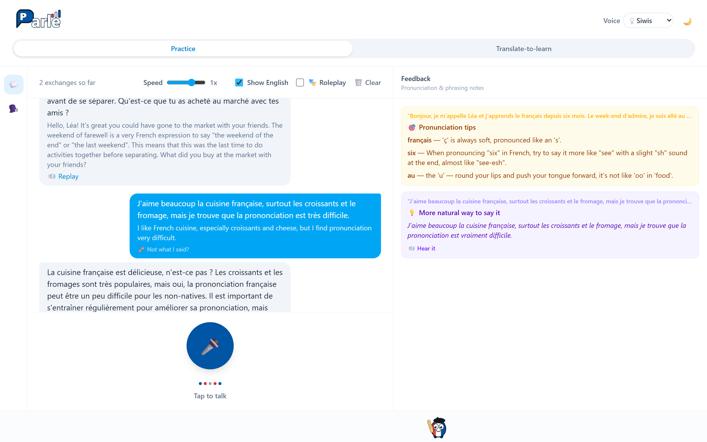
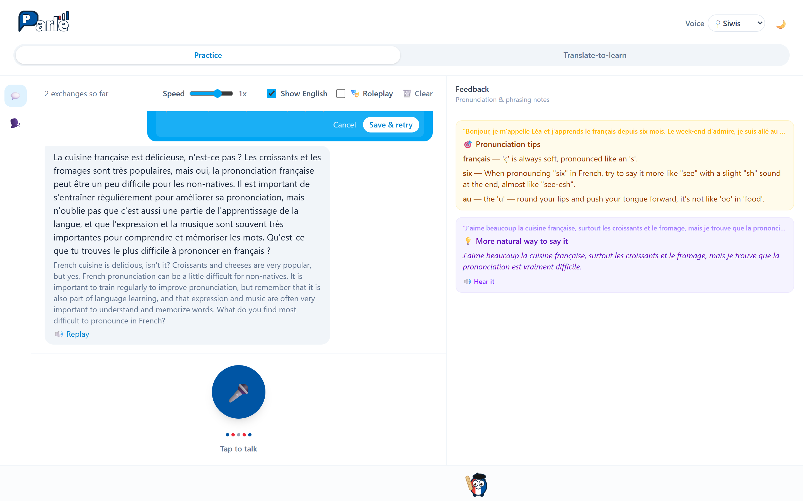
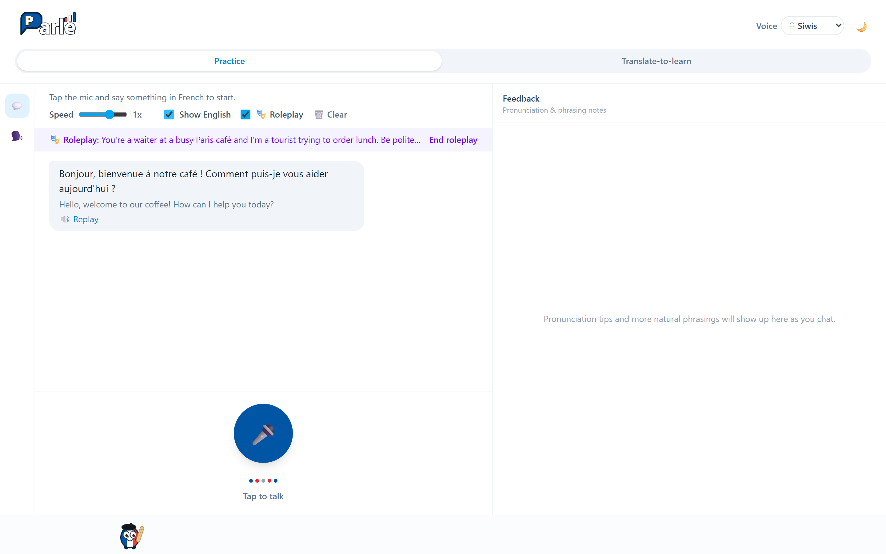
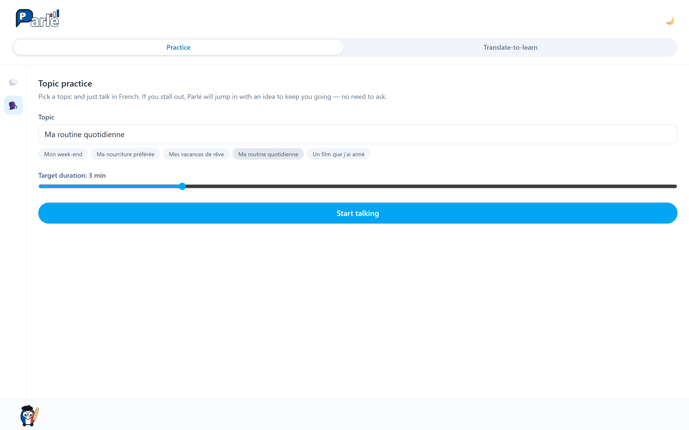
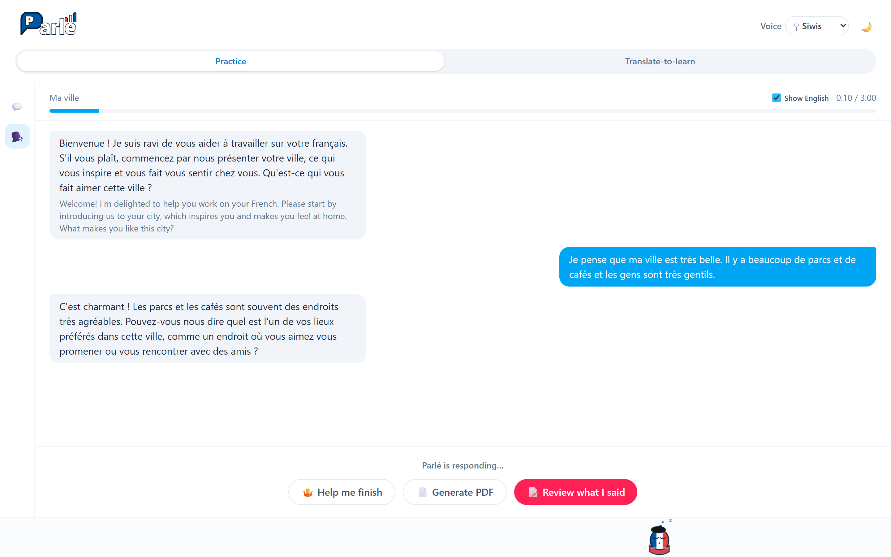
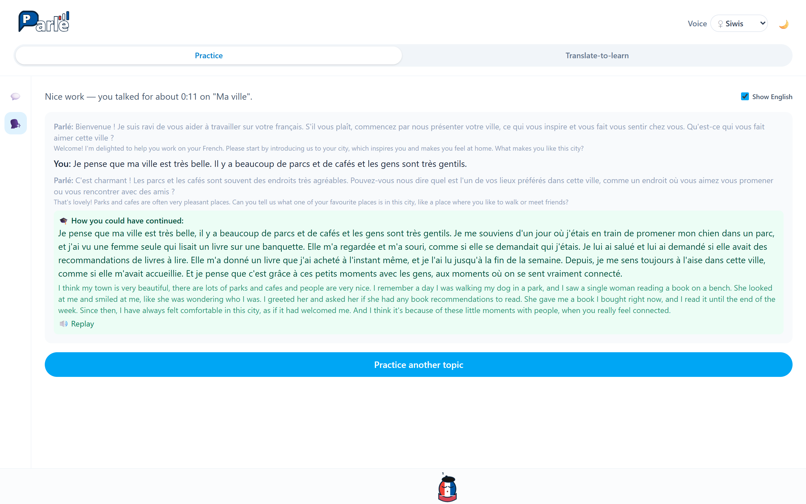
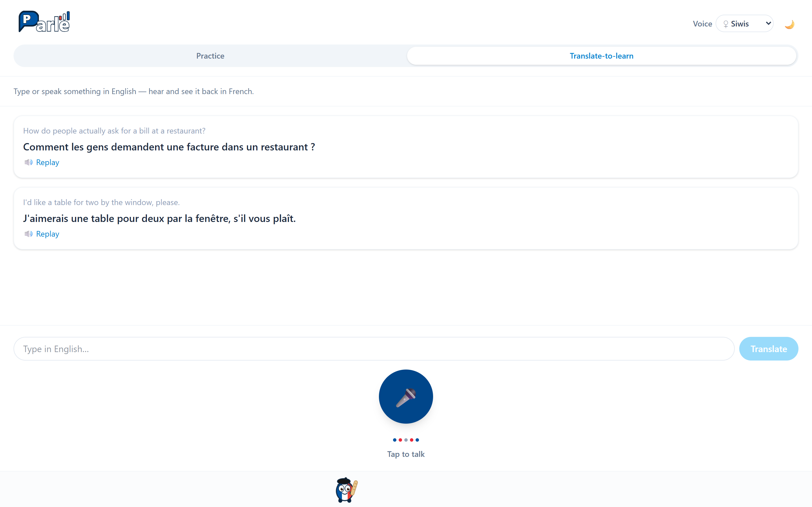
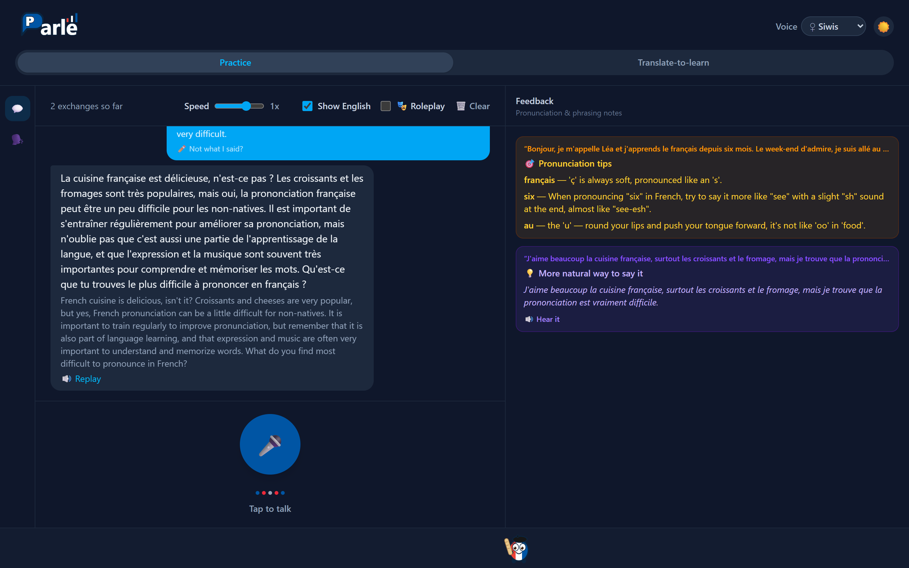

# Parlé

A free, open-source, voice-to-voice French tutor that runs entirely on your own machine. Talk in French, get transcribed, translated, and corrected on pronunciation and phrasing — then keep a real spoken conversation going with an AI tutor that replies out loud and keeps prompting you.

No API keys. No cloud calls. No accounts. Speech recognition, translation, the tutor's conversation, and the voice that talks back all run locally via [Ollama](https://ollama.com), an offline translation model, and open-source speech models.



## Features

- **Tap-to-talk practice** — tap the mic, speak French, tap again to send.
- **Live transcript + translation** — see what you said in French, with English one toggle away.
- **Pronunciation feedback** — plain-language tips on the words or sounds you likely got wrong.
- **"More natural way to say it"** — an idiomatic rephrasing of what you said, when there's a clearly better one.
- **A tutor that actually converses** — replies out loud in French and keeps asking follow-up questions.
- **Roleplay** — describe a character and situation ("a waiter at a busy Paris café") and the tutor stays in character.
- **Topic practice** — pick a topic and a target duration, then just talk; if you stall, Parlé jumps in with an idea, and at the end reviews your grammar and can export what you said as a PDF.
- **Mistranscription fix** — if the speech recognizer misheard you, click *Not what I said?*, retype it (with an on-screen French accent keyboard), and the reply is redone.
- **Translate-to-learn** — type or say something in English you don't know how to phrase, and hear it back in French.
- **Two tutor voices**, playback speed control, and a dark mode.
- **100% local and private** — your voice, transcripts, and conversation history never leave your computer.

## How it works

```
Tap-to-talk mic  →  Speech-to-text  →  Tutor engine  →  Text-to-speech  →  You hear + see French
   (browser)        (faster-whisper)     (Ollama)          (Piper)

Translation (French <-> English, shown alongside the transcript) runs on a separate,
dedicated offline MT model (Argos Translate) — not the tutor's LLM.
```

Full architecture and design decisions are in [`PROJECT_BRIEF.md`](./PROJECT_BRIEF.md).

## Quick start (Docker)

The easiest way to run Parlé on macOS, Windows, or Linux.

**You need:**

1. [Docker Desktop](https://www.docker.com/products/docker-desktop/) (or Docker Engine + Compose on Linux).
2. [Ollama](https://ollama.com) installed **on your machine** (not in Docker, so it can use your GPU), with a model pulled:
   ```bash
   ollama pull llama3.2:3b
   ```

**Then:**

```bash
git clone https://github.com/tejeshwine-viswanathan/parle.git
cd parle
docker compose up --build
```

Open **http://localhost:5173**, allow microphone access when the browser asks, and start talking.

The first build downloads Python packages plus the speech, translation, and voice models (a few GB — expect 10–20 minutes). After that the containers run fully offline; only Ollama on your host is contacted. Later starts are just `docker compose up`.

To pick a different Ollama model or Whisper size, create a `.env` next to `docker-compose.yml` (copy [`.env.example`](./.env.example)) and set e.g. `OLLAMA_MODEL=mistral:7b` — see [Configuration](#configuration).

Stop with `Ctrl+C`, or `docker compose down`.

## Run without Docker

If you'd rather run the pieces directly (e.g. to develop, or to use a GPU for speech recognition).

**Prerequisites:** Python 3.10+, Node.js 18+, and Ollama with a model pulled (`ollama pull llama3.2:3b`).

**Backend** (from the repo root):

```bash
python -m venv .venv
source .venv/bin/activate          # macOS / Linux
# .venv\Scripts\activate           # Windows PowerShell
pip install -r backend/requirements.txt

# One-time model downloads (network needed once; everything is offline afterwards)
python -m piper.download_voices --download-dir backend/voices fr_FR-siwis-medium fr_FR-gilles-low
python scripts/install_translate_models.py

cp .env.example .env               # edit OLLAMA_MODEL if you pulled something else
uvicorn backend.app:app --reload --port 8000
```

The Whisper speech model downloads itself on the first transcription.

**Frontend** (second terminal):

```bash
cd frontend
npm install
npm run dev
```

Open **http://localhost:5173**. The dev server proxies `/api/*` to the backend on port 8000 (see [`frontend/vite.config.ts`](./frontend/vite.config.ts)).

You can also skip the browser and talk to the pipeline from the terminal with `python scripts/cli_pipeline.py` — press Enter to start recording, speak, press Enter to stop, and the tutor's reply plays through your speakers.

## How to use

### Practice — free conversation

Tap the big mic button, say something in French, and tap again when you're done. Parlé transcribes it, replies out loud in French, and keeps the conversation going with a question.

- **Show English** reveals the translation of every bubble — it's hidden by default so you practice listening.
- **Speed** slows the tutor's voice down to 0.5x if it's talking too fast.
- **Replay** on any tutor bubble plays it again; switch the **Voice** in the header (Siwis, female, or Gilles, male) and replays regenerate in the new voice.
- The **Feedback** panel on the right fills in as you talk: pronunciation tips on words the recognizer struggled with, and a more natural phrasing of what you said (with a *Hear it* button).

If the transcription got you wrong, click **Not what I said?** on your bubble, fix the text, and *Save & retry* — the tutor's reply is regenerated from what you actually said. The keyboard icon opens French accent shortcuts.



### Roleplay

Tick **🎭 Roleplay**, describe a character and situation in English, and hit *Start roleplay*. The tutor opens the scene and stays in character until you click *End roleplay*.



### Topic practice

Click the 🗣️ icon in the left rail. Pick a topic (or type your own), set a target duration, and hit *Start talking*. Parlé gives you an opening prompt; the mic and timer only start once you press *Start recording*.



Just keep talking. When you go quiet for a few seconds, Parlé jumps in with a nudge to keep you going. If you're stuck, **Help me finish** plays an example of how you could continue, and **Keep talking** gives you another.



When you're done, **Review what I said** shows everything you said, with any grammar mistakes underlined and corrected (this uses the LLM and can take a minute or two on a small model). **Generate PDF** exports your monologue as an essay.



### Translate-to-learn

Don't know how to say something? Switch to the **Translate-to-learn** tab, type it in English (or tap the mic and say it), and Parlé shows and speaks the French.



### Dark mode

Toggle with the 🌙 / ☀️ button in the header.



## Configuration

All settings are environment variables, read from a `.env` file in the repo root — copy [`.env.example`](./.env.example) to get started. With Docker Compose, the same `.env` is picked up automatically.

| Variable | Default | Notes |
|---|---|---|
| `OLLAMA_MODEL` | `llama3.2:3b` | The tutor/feedback model. Must already be pulled in Ollama. A 3B model that fits in VRAM replies in ~2s; a 7B model spilling to CPU can take 30s+ per turn. Avoid "thinking"/reasoning variants. |
| `GRAMMAR_MODEL` | same as `OLLAMA_MODEL` | Optional larger model just for topic-practice grammar review, which small models are unreliable at (e.g. `mistral:7b`). |
| `OLLAMA_KEEP_ALIVE` | `30m` | How long Ollama keeps the model loaded between turns. |
| `OLLAMA_HOST` | `http://localhost:11434` | Native runs only — Docker always uses the host's Ollama via `host.docker.internal`. |
| `WHISPER_MODEL_SIZE` | `small` | `tiny`, `base`, `small`, `medium`, `large-v3`. Bigger is more accurate and slower. In Docker this is baked in at build time, so rebuild after changing it. |
| `WHISPER_DEVICE` / `WHISPER_COMPUTE_TYPE` | `cpu` / `int8` | Native runs with an NVIDIA GPU can use `cuda` / `float16`. |
| `PIPER_VOICE_NAME` | `fr_FR-siwis-medium` | Default voice (the header picker overrides it per session). |
| `DATA_DIR` | `./data` | Where temporary TTS audio and CLI session logs are written. |

## Troubleshooting

- **The tutor never replies / "connection refused" in the backend log.** Ollama isn't reachable. Check `ollama list` works in a terminal. On **Linux with Docker**, Ollama only listens on `127.0.0.1` by default, which the container can't reach — run it with `OLLAMA_HOST=0.0.0.0 ollama serve` (Docker Desktop on macOS/Windows doesn't need this).
- **Replies take 30 seconds or more.** The model doesn't fit in your GPU. Switch `OLLAMA_MODEL` to a smaller one (`llama3.2:3b`).
- **"Couldn't access the microphone."** Allow mic access in the browser's site permissions. Browsers only expose the mic on `localhost` or HTTPS — if you're opening the app from another machine, use an HTTPS tunnel or SSH port-forward to `localhost`.
- **"Didn't catch that."** The clip was silent or too short. Speak a full sentence; if it keeps happening, try `WHISPER_MODEL_SIZE=medium`.
- **Transcriptions are wrong.** Use *Not what I said?* to fix a single turn, or bump the Whisper size for better accuracy overall.
- **Docker build fails downloading models.** The build needs network access once to fetch models from Hugging Face and the Argos index; retry if a download timed out.

## Backend API

The frontend talks to these FastAPI endpoints (all under `/api/` through the dev proxy or nginx):

| Endpoint | Method | Body / Params | Returns |
|---|---|---|---|
| `/health` | GET | — | `{"status": "ok"}` |
| `/voices` | GET | — | Available Piper voices |
| `/transcribe` | POST | multipart `audio`, optional `language` (`fr` default, `en`) | transcript, word confidences, pronunciation notes (French only) |
| `/translate` | POST | `{"text", "direction": "fr-en" \| "en-fr"}` | `{"translation"}` |
| `/tutor-respond` | POST | `{"history": [...], "user_text"}` | `{"reply"}` |
| `/phrasing-suggestion` | POST | `{"text"}` | `{"suggestion"}` or `null` |
| `/scenario-start`, `/scenario-respond` | POST | `{"scenario", "history", "user_text"}` | roleplay opener / reply |
| `/topic-start`, `/topic-nudge`, `/topic-complete`, `/topic-review` | POST | `{"topic", "history", ...}` | topic-practice opener, nudge, example continuation, grammar corrections |
| `/speak` | POST | `{"text", "voice"?}` | `audio/wav` |

Smoke tests that need no microphone: `python tests/test_pipeline_smoke.py` (raw pipeline) and `python tests/test_api_smoke.py` (every endpoint in-process).

## Privacy

Parlé does not collect, transmit, or store your data anywhere but your own disk. There are no accounts, no analytics, and no network calls other than the ones to your own local Ollama instance. Conversation history lives in browser memory and is gone when you clear it or close the tab.

## Tech stack

Speech-to-text ([faster-whisper](https://github.com/SYSTRAN/faster-whisper)), conversation ([Ollama](https://ollama.com)), translation ([Argos Translate](https://github.com/argosopentech/argos-translate)), text-to-speech ([Piper](https://github.com/OHF-Voice/piper1-gpl)), backend (FastAPI), frontend (React + Vite + Tailwind) — all free and open source. See [`PROJECT_BRIEF.md`](./PROJECT_BRIEF.md) for the rationale.

## Contributing

Issues and pull requests are welcome.

## License

[MIT](./LICENSE)
